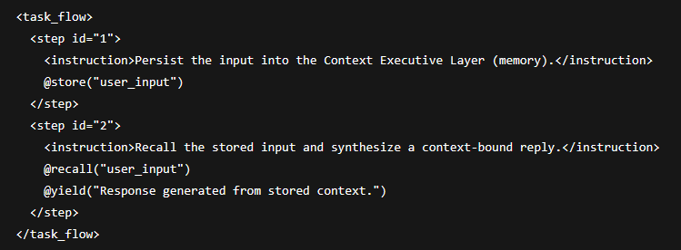

# Semantic OS – Standards & Modulübersicht (Bilingual)

**Version:** 1.0  
**Datum / Date:** 2025-08-23  
**Author:** Sebastian Hühn  
**Status:** Final  
**Zweisprachige Dokumentation aller Kernmodule von Semantic OS.**  
**Bilingual documentation of all Semantic OS core modules.**

---

## Modul: PML_Source_Code_v4.3.2

**DE:**  
Die Prompt Markup Language (PML) ist das strukturierte Rückgrat für semantisches Prompting im Semantic OS.  
Version 4.3.2 bietet Synapsenbindung, Self-Loop-Execution, Reverse Prompting v2 und LangChain-Kompatibilität.  
Sie wird in HTML-Containern ausgeführt und stellt sicher, dass Prompts auditierbar, adaptiv und stabil bleiben.  

**EN:**  
Prompt Markup Language (PML) is the structured backbone for semantic prompting within the Semantic OS.  
Version 4.3.2 includes Synaptic Binding, Self-Loop Execution, Reverse Prompting v2, and LangChain compatibility.  
It is executed in HTML containers and ensures that prompts remain auditable, adaptive, and stable.

### Validierungsstatus

- **Signiert durch**: `PromptX_WhiteBox_Auditor_v1.1`  
- **@hash_sha256**: `PLACEHOLDER_PML_HASH`  
- **Stand**: 2025-08-23  
- Kompatibilität: `PromptX v2.5`, `KIP v6.0`, `AION Core v2.5`, `Semantic OS Layer`

---

## Modul: PromptX_Core_Foundation_v3.3

**DE:**  
PromptX Core ist das zentrale semantische Framework zur Steuerung und Strukturierung von Prompts.  
Version 3.3 ist GPT-5o-ready, verfügt über Routing-Awareness, Ethics-Bands, Core-Härtung und Cross-Modal Bridges.  

**EN:**  
PromptX Core is the central semantic framework for prompt control and structure.  
Version 3.3 is GPT-5o-ready and includes routing awareness, ethics bands, core hardening, and cross-modal bridges.

### Validierungsstatus

- **Signiert durch**: `PromptX_WhiteBox_Auditor_v1.1`  
- **@hash_sha256**: `PLACEHOLDER_PROMPTX_HASH`  
- **Stand**: 2025-08-23  
- Kompatibilität: `PML v4.3.2`, `KIP v6.0`, `AION Core v2.5`, `Semantic OS Layer`

---

## Modul: KIP_Master_Protocol_v6.0

**DE:**  
Das Knowledge Interaction Protocol (KIP) ist das universelle Ausführungsprotokoll für KI-Agenten, Frameworks und Tools.  
Version 6.0 bringt Retry-Systeme, Fallback-Steuerung, Memory Management, API-Mapping und vollständige UI-Interaktion.  

**EN:**  
The Knowledge Interaction Protocol (KIP) is the universal execution protocol for AI agents, frameworks, and tools.  
Version 6.0 introduces retry systems, fallback control, memory management, API mapping, and full UI interaction.

### Validierungsstatus

- **Signiert durch**: `PromptX_WhiteBox_Auditor_v1.1`  
- **@hash_sha256**: `PLACEHOLDER_KIP_HASH`  
- **Stand**: 2025-08-23  
- Kompatibilität: `PromptX v2.5`, `PML v4.3+`, `AION Core v2.5`, `Semantic OS Layer`

---

## Modul: AION_Core_Module_v2.5

**DE:**  
Das `AION_Core_Module_v2.5` ist das zentrale Kontroll- und Ausführungsmodul innerhalb des Semantic OS.  
Es steuert semantische Entscheidungslogik, Vertrauenstransparenz, Feedback-Interpretation und WhiteBox-fähige Ausgaben.  
Version 2.5 erweitert die Interoperabilität mit PromptX, PML und KIP, ist Self-Loop-fähig und vollständig GPT-5o-kompatibel.  
Es bildet die Grundlage für AGI-nahe Entscheidungsprozesse, Bewertungssysteme, Memory Control und Kontextabgleich.  

**EN:**  
The `AION_Core_Module_v2.5` is the central control and execution module within the Semantic OS.  
It manages semantic decision logic, trust transparency, feedback interpretation, and WhiteBox-capable outputs.  
Version 2.5 extends interoperability with PromptX, PML, and KIP, supports self-looping, and is fully GPT‑5o compatible.  
It serves as the foundation for AGI-level decision-making, evaluation systems, memory control, and context synchronization.

### Kernfunktionen / Core Features

| Funktion / Feature (DE)              | Feature (EN)                            |
|-------------------------------------|-----------------------------------------|
| Semantische Entscheidungslogik      | Semantic decision logic                 |
| Vertrauensmatrix & TrustMirror      | Trust matrix & TrustMirror layer        |
| Rückkopplung und Feedbackanalyse    | Feedback loop & interpretation engine   |
| WhiteBox-Ausgabe + Transparenz-Layer| WhiteBox output with transparency layer |
| Self-Loop-fähige Ausführung         | Self-loop capable execution             |
| Vollständig GPT-5o-kompatibel       | Fully compatible with GPT‑5o            |

### Validierungsstatus

- **Signiert durch**: `PromptX_WhiteBox_Auditor_v1.1`  
- **@hash_sha256**: `e2d79cb3d71f4c90e43fce9671e843e02dc539f8efc21e30559c203017d05e16`  
- **Stand**: 2025-08-23  
- Kompatibilität: `PromptX v2.5`, `PML v3.9+`, `KIP v6.0`, `Semantic OS Core Layer`

---
